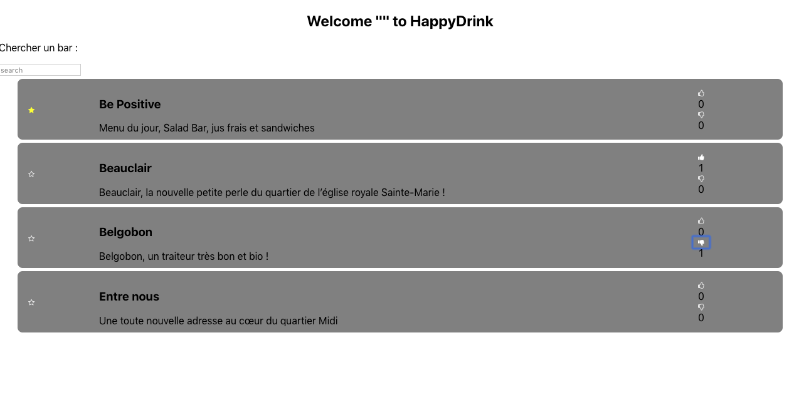
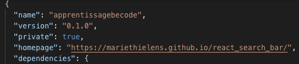
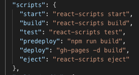

# react trouver un bar bio

Vous pouvez tester l'application en suivant ce lien : https://mariethielens.github.io/react_search_bar/ 

## Intro à réact pour comprendre comment mettre une githubPage

Voici une applicaion qui permet de :

    - Faire une recherche à partir du nom d'un bar
    - Mettre en favori
    - Liker ou disliker un bar

## Technologies

- ReactJS
- gitHub Pages

## Tester

1. Cloner le repo sur votre machine: `git clone `
2. Effectuer les commande suivante : 
    - `npm install` pour installer les modules
    - `npm start` pour lancer l'application

## GitHub Pages

- Installer le parquet gh-pages : `npm install —save gh-pages`
- Modifier package.json et mettre la page d’accueil :

=> `https://[your-user-name].github.io/[your-repo-name]/`

- Modifier le package.json et mettre predeploy et deploy

    - predeploy spécifie la commande à créer avant le déploiement
    - deploy spécifie quelle branche déployer
- Deployer l'application : `npm run deploy``

## Les fichiers

### 

### components / lieu / lieuData.js

Tableau d'objets qui contient les infos sur les restaurants.

## Auteur

Nom : Marie Thielens

Email: thielens.marie@gmail.com

Site : https://www.thielens-marie.be/